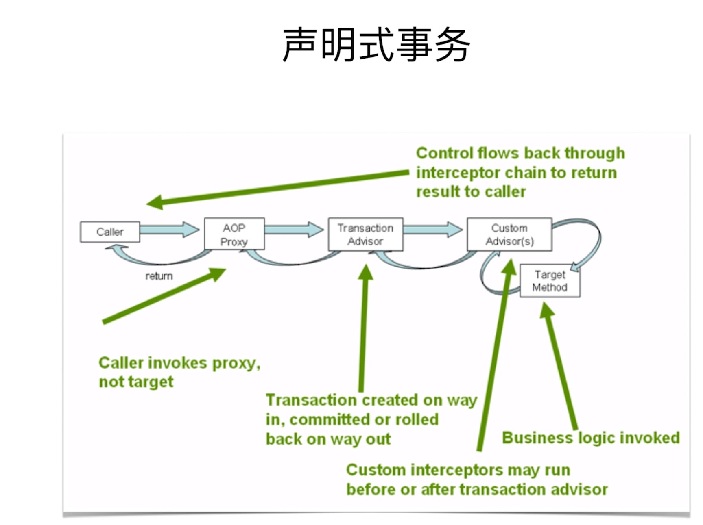

# ***SpringBoot事务***
## ***一、事务抽象的核心接口***
1. PlatformTransactionManager(事务管理)
- DataSourceTransactionManager （DataSource）
- HibernateTransactionManager （Hibernate）

- JtaTransactionManager （jta）

  
2. TransactionDefinition（定义事务）
- Propagation（传播特性）
- Isolation （隔离性）
- Timeout （超时特性）
- Read-only status （只读性）
3. 代码示例：
```java
void commit(TransactionStatus status) throws TransactionException;
void rollback(TransactionStatus status) throws TransactionException;
TransactionStatus getTransaction(@Nullable TransactionDefinition definition) throws TransactionException;
```
## ***二、事务传播特性***
传播性 | 值 | 描述
----------| ----| -----
PROPAGATION_REQUIRED | 0 | 当前有事务就用当前的，没有就用最新的
PROPAGATION_SUPPORTS | 1 | 事务可有可无，不是必须的
PROPAGATION_MANDATORY | 2 | 当前一定要有事务，不然就抛异常
PROPAGATION_REQUIRES_NEW | 3 | 无论是否有事务，都起个新的事务
PROPAGATION_NOT_SUPPORTED | 4 | 不支持事务，按非事务方式运行
PROPAGATION_NEVER | 5 | 不支持事务，如果有事务则抛异常
PROPAGATION_NESTED | 6 | 当前有事务就在当前事务里再起一个事务
## ***三、编程式事务***    
TransactionTemplate （类）
- TransactionCallback
- TransactionCallbackWithoutResult
PlatformTransactionManager
- 可以传入TransactionDefinition进行定义事务属性
## ***四、声明式事务 （基于注解的配置方式）***

【注】声明式事务，spring主要通过AOP实现。

### **开启事务注解的方式**

@EnableTransactionManagement

 xml文件： <tx:annotation-driven/>

## 一些配置

- ProxyTargetClass 是否对类做增强
- mode 是否使用java/aspect4j
- Order aop拦截顺序，默认最低优先级

添加@Transactional注解

- TransactionManager （DataSource， Hibernate， jta）
- propagation
- isolation
- timeout
- readOnly
- 判断回滚：注解中设置碰到特定异常类时回滚。@Transactional（rollbackFor=RollbackException.class)

