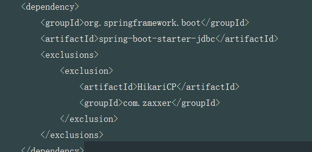
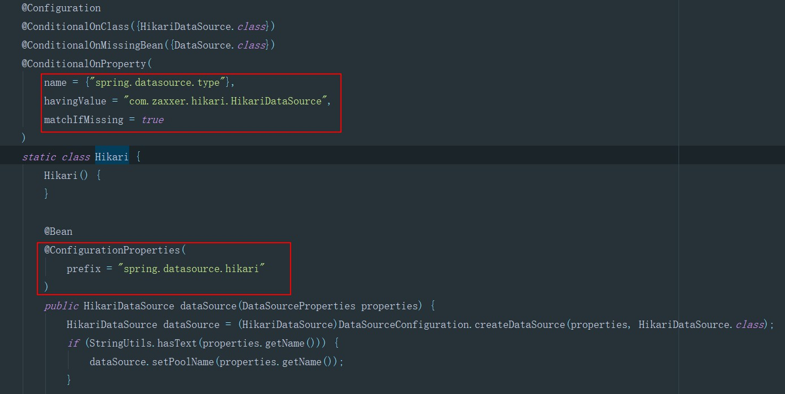
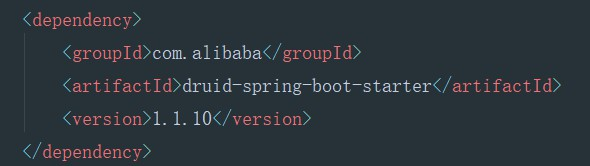

# ***SpringBoot对数据源的自动配置***
## **DataSourceAutoConfiguration**
 - 配置DataSource（标题为类名）
## **DataSourceTransactionManagerAutoConfiguration**
 - 配置DataSourceTransactionManager（标题为类名）
## **JdbcTemplateAutoConfiguration**
 - 配置jdbcTemplate（标题为类名）
# ***单数据源相关配置属性***
## 通用
- spring.datasource.url=jdbc:mysql://localhost/test
- spring.datasource.username=dbuser
- spring.datasource.password=dbpass
- spring.datasource.driver-class-name=com.mysql.jdbc.Driver(可选)
## 初始化内嵌数据库
- spring.datasource.initialization-mode=embedded | always | never
- spring.datasource.schema与spring.datasource.data确定初始化SQL文件
- 在resource文件夹下配置schema.sql和data.sql文件即可被springBoot自动识别
- spring.datasource.platform=hsqldb | h2 | oracle | mysql | postgresql
# ***多数据源配置*** 
### **注意：**
不同数据源的配置要分开
关注每次使用的数据源
- 有多个DataSource时系统如何判断
- 对应的设施（事务，ORM等）如何选择DataSource
### **方法：**
- 配置@Primary类型的Bean，springboot的配置将主要围绕有@Primay的bean
- 屏蔽掉spring对DataSource和transaction的封装：
   - DataSourceAutoConfiguration
   - DataSourceTransactionManagerAutoConfiguration
   - JdbcTemplateAutoConfiguration
```java
@SpringBootApplication(exclude = { DataSourceAutoConfiguration.class, DataSourceTransactionManagerAutoConfiguration.class, JdbcTemplateAutoConfiguration.class})
@slf4j
public class MultiDataSourceDemoApplication{
   ...
}
```
# ***数据池选择***
## HikariCP数据库连接池使用说明

**如何使用：**



**1. hikariCP为什么运行快**
   - 字节码级别的优化（很多方法通过JavaAssist生成）
   - 大量小改进
     - 用FastStatementList代替ArrayList
     - 无锁集合ConcurrentBag
     - 代理类的优化（比如， 用invokestatic代替了invokevirtual

**2. hikari配置类**



**3.常用HikariCP配置参数**

**常用配置（写在application.properties中）**
- spring.datasource.hikari.maximumPoolSize=10
- spring.datasource.hikari.minimumIdle=10
- spring.datasource.hikari.idleTimeout=600000
- spring.datasource.hikari.connectionTimeout=30000
- spring.datasource.hikari.maxLifetime=1800000
 ## druid数据库连接池使用说明
**如何使用：**

 

**常用配置（写在application.properties中）**
1. Filter配置
- spring.datasource.druid.filters=stat,config,wall,log4j(全部使用默认设置)
2. 密码加密
- spring.datasource.password=加密密码
- spring.datasource.druid.filter.config.enabled=true
- spring.datasource.druidconnection-properties=config.decrypt=true;config.decrypt.key=public-key
3. SQL防注入
- spring.datasource.druid.filter.wall.enabled=true
- spring.datasource.druid.filter.wall.db-type=h2
- spring.datasource.druid.filter.wall.config.delete-allow=false
- spring.datasource.druid.filter.wall.config.drop-table-allow=false

4. Druid Filter
- 用于定制连接池操作的各种环节
- 可以继承FilterEventAdapter以便方便地实现Filter
- 修改META-INF/druid-filter.properties增加Filter配置
## SQL批处理
jdbcTemplate
- batchUpdate
  - BatchPreparedStatementSetter 通过设置getBatchSize()函数来设置批处理操作要插入的条数。

- batchUpdate
  -  NamedParameterJdbcTemplate 
     - SqlParameterSourceUtils.createBatch（list）传入一个数据list来批处理插入数据。
