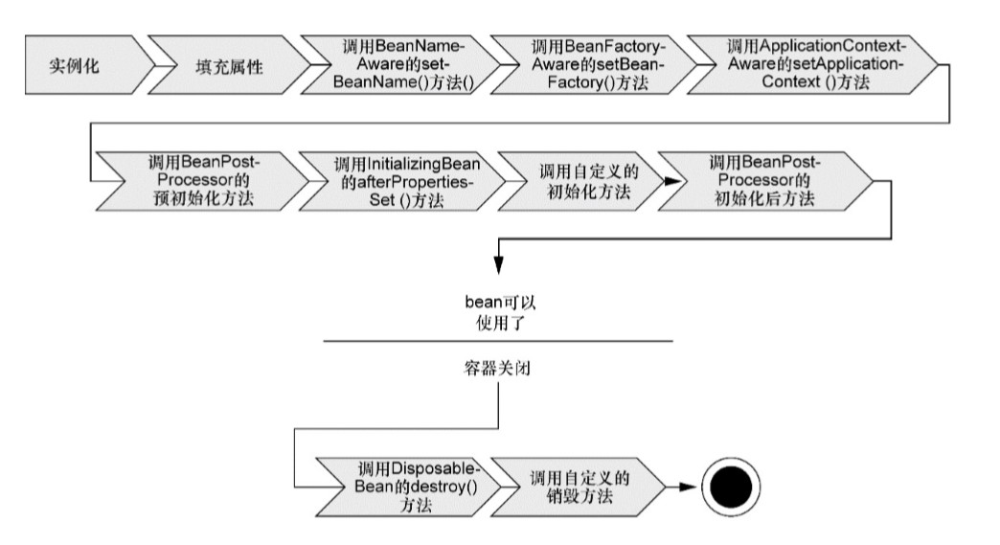
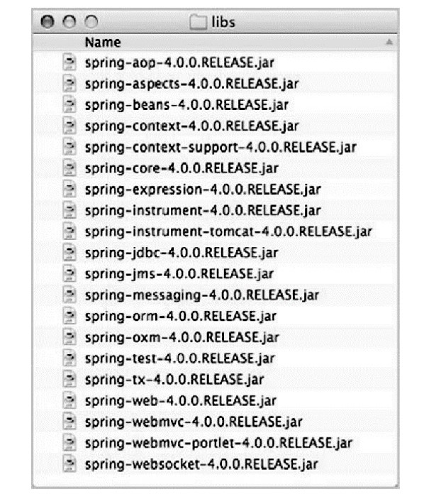
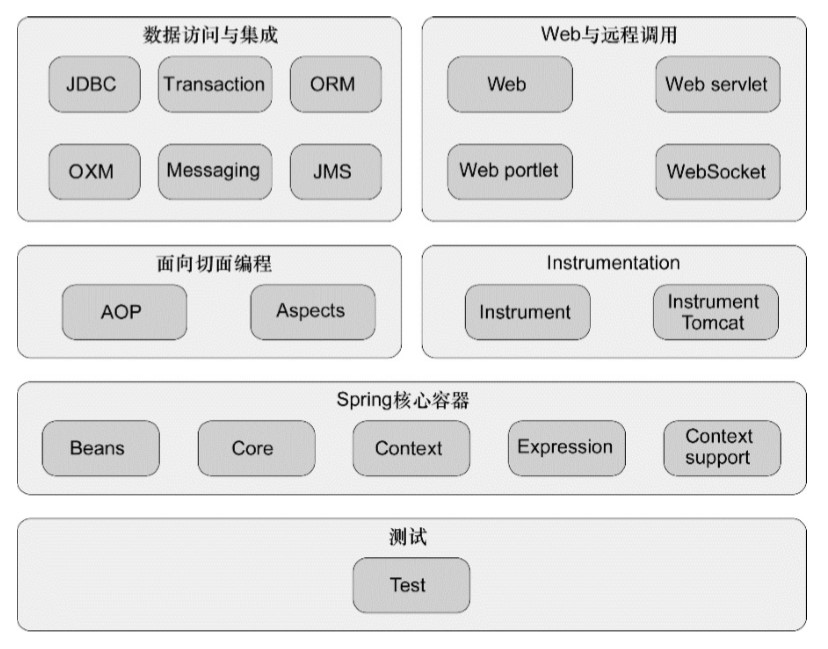
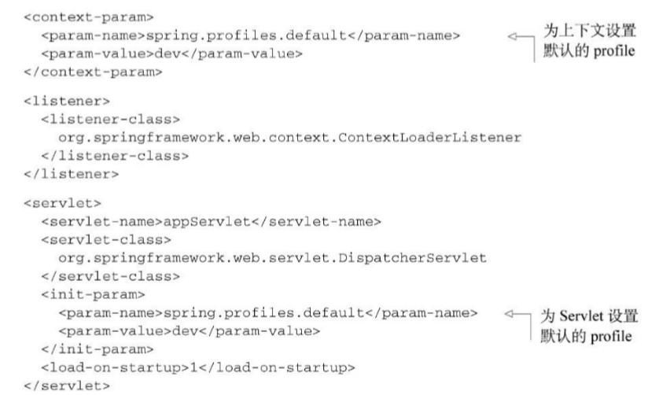

- [***Spring 学习笔记***](#spring-%e5%ad%a6%e4%b9%a0%e7%ac%94%e8%ae%b0)
  - [**一、spring初识：**](#%e4%b8%80spring%e5%88%9d%e8%af%86)
    - [**1.IOC和DI：**](#1ioc%e5%92%8cdi)
    - [**2.应用切面（AOP）：**](#2%e5%ba%94%e7%94%a8%e5%88%87%e9%9d%a2aop)
    - [**3.使用模板消除样板类代码**](#3%e4%bd%bf%e7%94%a8%e6%a8%a1%e6%9d%bf%e6%b6%88%e9%99%a4%e6%a0%b7%e6%9d%bf%e7%b1%bb%e4%bb%a3%e7%a0%81)
    - [**4.使用spring自带的应用上下文**](#4%e4%bd%bf%e7%94%a8spring%e8%87%aa%e5%b8%a6%e7%9a%84%e5%ba%94%e7%94%a8%e4%b8%8a%e4%b8%8b%e6%96%87)
    - [**5.正确理解bean的生命周期**](#5%e6%ad%a3%e7%a1%ae%e7%90%86%e8%a7%a3bean%e7%9a%84%e7%94%9f%e5%91%bd%e5%91%a8%e6%9c%9f)
  - [**二、Spring配置的可选方案**](#%e4%ba%8cspring%e9%85%8d%e7%bd%ae%e7%9a%84%e5%8f%af%e9%80%89%e6%96%b9%e6%a1%88)
    - [1.自动化装配bean](#1%e8%87%aa%e5%8a%a8%e5%8c%96%e8%a3%85%e9%85%8dbean)
    - [2.为组件扫描的bean命名](#2%e4%b8%ba%e7%bb%84%e4%bb%b6%e6%89%ab%e6%8f%8f%e7%9a%84bean%e5%91%bd%e5%90%8d)
    - [3.ComponentScan包扫描](#3componentscan%e5%8c%85%e6%89%ab%e6%8f%8f)
    - [4.通过为bean添加注解，来实现自动装配](#4%e9%80%9a%e8%bf%87%e4%b8%babean%e6%b7%bb%e5%8a%a0%e6%b3%a8%e8%a7%a3%e6%9d%a5%e5%ae%9e%e7%8e%b0%e8%87%aa%e5%8a%a8%e8%a3%85%e9%85%8d)
    - [5.通过Java代码装配bean](#5%e9%80%9a%e8%bf%87java%e4%bb%a3%e7%a0%81%e8%a3%85%e9%85%8dbean)
    - [6.不同于构造器注入，来看看属性注入](#6%e4%b8%8d%e5%90%8c%e4%ba%8e%e6%9e%84%e9%80%a0%e5%99%a8%e6%b3%a8%e5%85%a5%e6%9d%a5%e7%9c%8b%e7%9c%8b%e5%b1%9e%e6%80%a7%e6%b3%a8%e5%85%a5)
    - [7.在JavaConfig中引入xml配置](#7%e5%9c%a8javaconfig%e4%b8%ad%e5%bc%95%e5%85%a5xml%e9%85%8d%e7%bd%ae)
    - [8.在xml中引入JavaConfig配置](#8%e5%9c%a8xml%e4%b8%ad%e5%bc%95%e5%85%a5javaconfig%e9%85%8d%e7%bd%ae)
  - [**三、spring高级装配**](#%e4%b8%89spring%e9%ab%98%e7%ba%a7%e8%a3%85%e9%85%8d)
    - [**1.设置profile**](#1%e8%ae%be%e7%bd%aeprofile)
    - [**2.如何激活profile**](#2%e5%a6%82%e4%bd%95%e6%bf%80%e6%b4%bbprofile)
    - [**3.条件化的Bean**](#3%e6%9d%a1%e4%bb%b6%e5%8c%96%e7%9a%84bean)
# ***Spring 学习笔记***
## **一、spring初识：**
### **1.IOC和DI：**
- spring通过xml配置文件将JavaBean注入到相关组件当中，提倡松耦合，即使用对象只通过接口（而不是具体实现或初始化过 程）来表明依赖关系，那么这种依赖就能够在对象本身毫不知情的情 况下，用不同的具体实现进行替换。
- property元素的name特性对应于一个满足bean依赖关系的JavaBean风格的setter方法，ref特性指的是另一个Bean。
- 如果使用工厂模式来进行bean的注册的话应该加入factory-method属性。
- 无论spring容器如何（使用无参构造函数和工厂方法得到的都是相同的效果）
- 通过applicationContext.xml来进行装配JavaBean。其中可以写一些Spring表达式语言。
- 同时也可以使用基于java的配置而不是使用xml配置文件。
- 启动：bean是使用XML文件进行配置的，所以选择 *ClassPathXmlApplicationContext*作为应用上下文相对是比 较合适的。该类加载位于应用程序类路径下的一个或多个XML配置文件。程序中的main()方法调 用ClassPathXmlApplicationContext加载xxx.xml，并获得对象的引用。 
### **2.应用切面（AOP）：**
- 可以将遍布应用各处的功能分离出来形成可重用的组件。
- AOP能够确保POJO的简单性。
- 在xml中使用\<aop config\>标签来配置切面。首先要将切面方法配置成Bean。在aop:pointcut配置切点，使用aop:before / aop:after标签来配置，在切点方法前后调用什么通知。
- 当你使用aop配置pointcut时注意要导入aspectjweaver-1.8.7.jar依赖包。
### **3.使用模板消除样板类代码**
例如： jdbcTemplate
### **4.使用spring自带的应用上下文**
- AnnotationConfigApplicationContext: 从一个或多个基于Java的配置类中加载Spring应用上下文。
- AnnotationConfigWebApplicationContext: 从一个或多个基于Java的配置类中加载Spring Web应用上下文。
- ClassPathXmlApplicationContext: 从类路径下的一个或多个XML配置文件中加载上下文定义，把应用上下文的定义文件作为类资源。
- FileSystemXmlApplicationContext: 从文件系统下一个或多个xml配置文件中加载上下文定义。
classPath和fileSystem主要的区别就是一个从绝对路径中获取配置文件，classpath从所有类路径（包括jar文件）下获取配置文件。
### **5.正确理解bean的生命周期**

**spring整个框架所需的所有jar包（20个）：**

**spring 六大主要模块：**

## **二、Spring配置的可选方案**
- 在xml中进行显式配置。
- 在java中进行显式配置。
- 隐式的bean发现机制和自动装配。
### 1.自动化装配bean
- 组件扫描（component scanning）： Spring会自动发现应用上下文 中所创建的bean。
- 自动装配（autowiring）：Spring自动满足bean之间的依赖。
### 2.为组件扫描的bean命名
Spring会通过类名来为bean设置一个ID，也就是将类名的第一个字母变成小写。
也可以通过使用@component（""）在冒号中添加想要的bean标识，同样使用@Named("")也是可以的。
### 3.ComponentScan包扫描
默认情况下，@ComponentScan扫描的为当前类内的所有子类。但是我们可以通过指定value值来设置基础包。
- **例：**
@componentScan("基础包名")
@componentScan(basePackages={"基础包名","基础包名"})
通过String的方式来标注basePackages容易在重构时出现问题，所以也可以通过使用@componentScan("basePackageClasses="")来指定组件类，扫描的为组件类所在的包。
### 4.通过为bean添加注解，来实现自动装配
- 自动装配就是让Spring自动满足bean依赖的一种方法，在 满足依赖的过程中，会在Spring应用上下文中寻找匹配某个bean需求 的其他bean。为了声明要进行自动装配，我们可以借助Spring的 @Autowired注解。 
- 不管是构造器、Setter方法还是其他的方法，Spring都会尝试满足方法 参数上所声明的依赖。假如有且只有一个bean匹配依赖需求的话，那 么这个bean将会被装配进来。 如果没有匹配的bean，那么在应用上下文创建的时候，Spring会抛出 一个异常。为了避免异常的出现，你可以将@Autowired的 required属性设置为false。
### 5.通过Java代码装配bean
  
### 6.不同于构造器注入，来看看属性注入
\<bean id="cdplayer" class="soundsystem.CDPlayer"\>
\<property name="compactDisc" ref="compactDisc"\>

\<property\>元素为属性的Setter方法所提供的功能 与\<constructor-arg\>元素为构造器所提供的功能是一样的。
- **装配bean引用与装配字面量的唯一区别在于是否 带有“-ref”后缀。如果没有“-ref”后缀的话，所装配的就是字面量。**
### 7.在JavaConfig中引入xml配置
@ImportResource注解，假设BlankDisc定义在名为cdconfig.xml的文件中，该文件位于根类路径下，那么可以修 改SoundSystemConfig，让它使用@ImportResource注解，来引入xml配置。
### 8.在xml中引入JavaConfig配置
没有任何一个专门的标签用来引入javaConfig配置类，但是我们可以通过bean标签来将其引入。
## **三、spring高级装配**
### **1.设置profile**
- 通过使用@Profile注解来实现通过激活不同的profile实现不同bean的装配。
- 有个问题需要注意，尽管每个DataSource bean都被声明在一个 profile中，并且只有当规定的profile激活时，相应的bean才会被创 建，但是可能会有其他的bean并没有声明在一个给定的profile范围 内。没有指定profile的bean始终都会被创建，与激活哪个profile没有 关系。
### **2.如何激活profile**
Spring在确定哪个profile处于激活状态时，需要依赖两个独立的属 性：spring.profiles.active和 spring.profiles.default。
有多种方式来设置这两个属性： 
- 作为DispatcherServlet的初始化参数； 
- 作为Web应用的上下文参数； 作为JNDI条目； 
- 作为环境变量； 
- 作为JVM的系统属性； 
- 在集成测试类上，使用@ActiveProfiles注解设置。 

### **3.条件化的Bean**
可以在带有@Bean注解的方法上使用@Conditional注解，如果给定的条件计算结果为true，就会创建这个Bean，否则Bean将忽略。
```java
@Bean
@Conditional (MagicExistsCondition.class)
public MagicBean magicBean(){
  return new MagicBean();
}
```